# emacs-vscode

Migrate from emacs to vscode

1. 安装插件：vim + VSpaceCode

2. control + F 设置为前进一个字符
   1. 在设置—键盘快捷方式—右上角打开 json
   2. 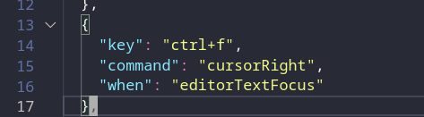

3.设置光标经过折叠的代码不自动打开
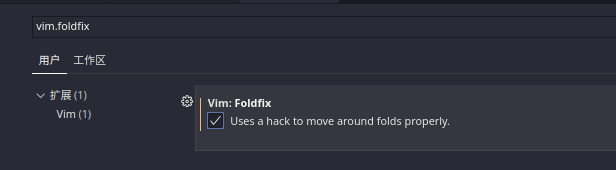

4. 隐藏左侧图标
   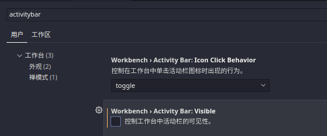

5. 设置行号宽度: 默认行号包含断点调试，行号，git/代码折叠 等信息，比较宽

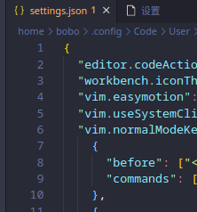
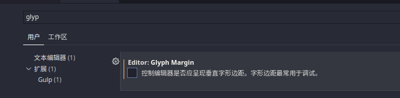
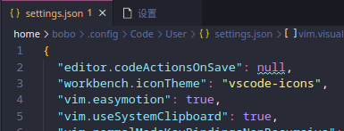

6. 去掉导航路径
   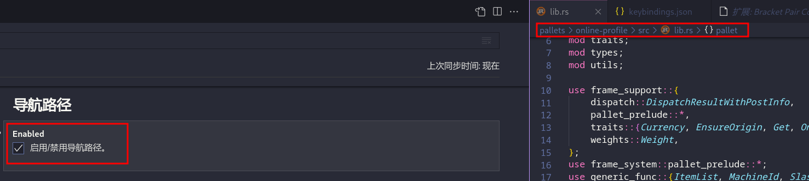

7. 去掉缩略图

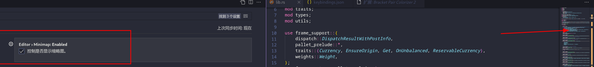

8. 禁用缩进参考线：下面设置将会禁用 1；

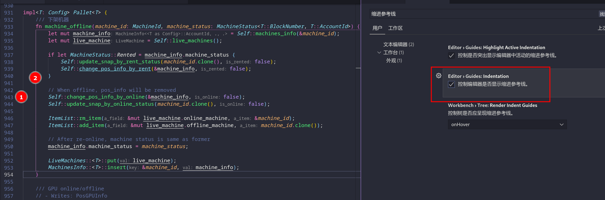

其他的色彩线，是 barcket pair colorizer2 的设置：，禁用掉水平线&竖直线：

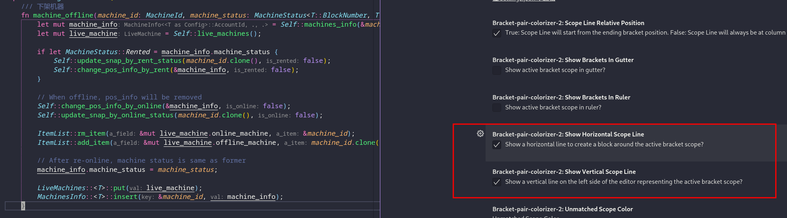

9. 去掉选中行的颜色框
   下面这个注释可以禁用选中行的周围的线，但是不能设置成高亮背景
   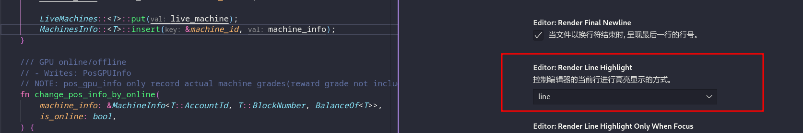

设置光标选中字母前景色，背景色颜色：设置及效果展示

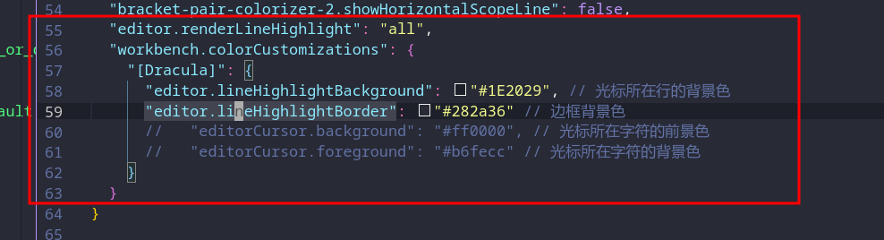

10. 快捷键: 与 doom emacs 不同的常用快捷键：
    zz 将光标行移动到屏幕中间

    M 将光标移动到屏幕中间

    gd 跳转定义；Ctrl + T 跳转回去

    Ctrl + b 侧栏可见性。与 vim 冲突，将 vim 的删掉

11. 设置字体

12. 禁用 rust 变量和变量的方法的下划线

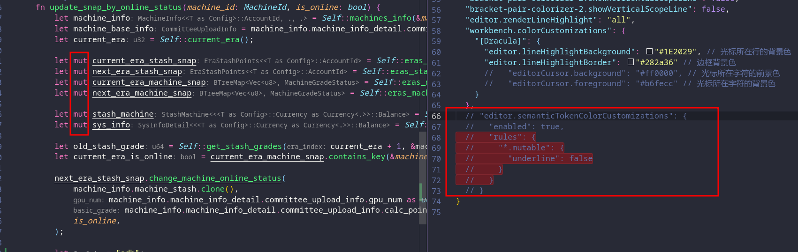

13. TODO: 设置 command paletee 位置，样式，宽度
